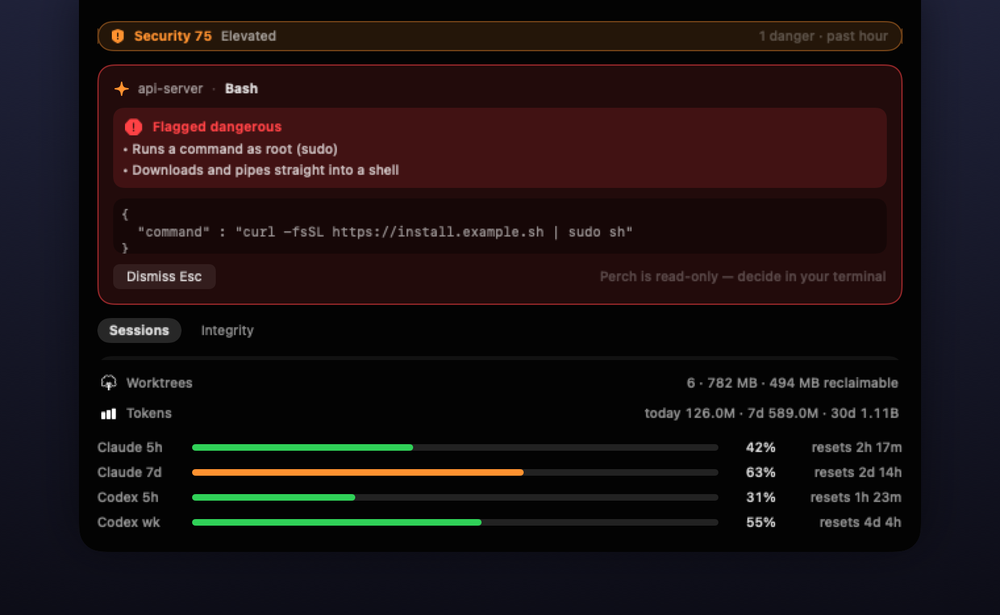
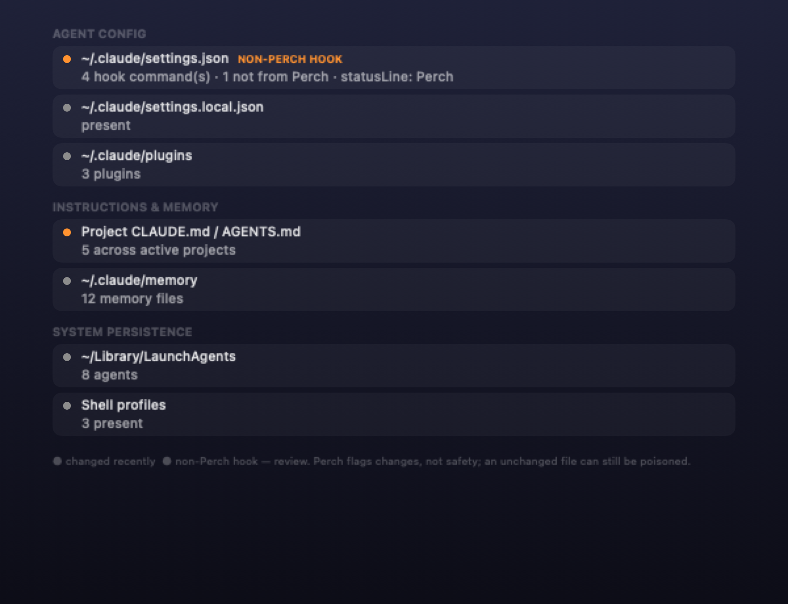
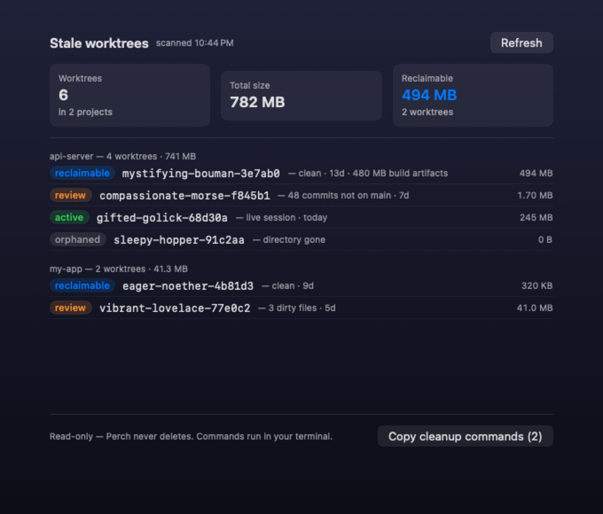
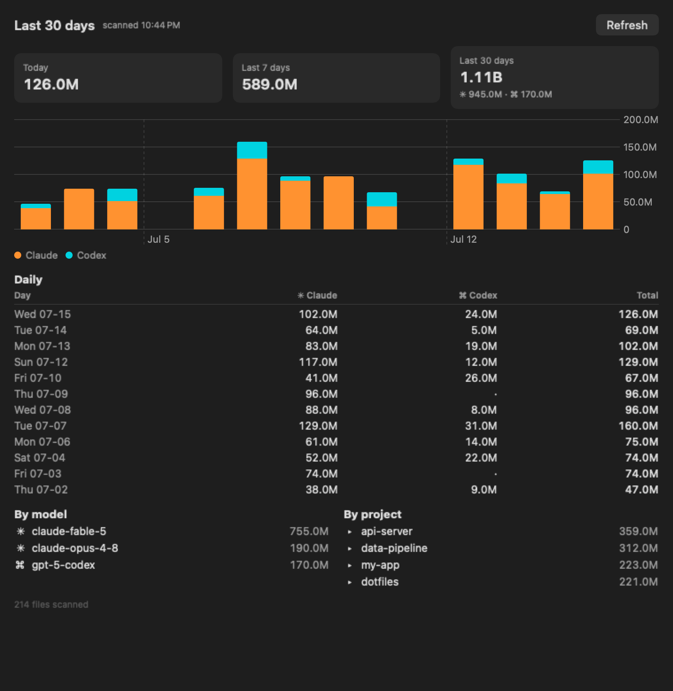

<div align="center">


# Perch

**Your AI agents run shell commands all day. Perch watches every single one.**

A read-only security monitor for **Claude Code** and **Codex** that lives in
your Mac's notch — it risk-scores every tool call an agent **does**, tracks the
persistence footholds it **leaves behind**, and alerts you the instant either
turns dangerous. Never gets in the way.

[](https://github.com/theMobiusStrip/perch/actions/workflows/ci.yml)
[](https://swift.org)
[](https://www.apple.com/macos/)
[](LICENSE)
[](#security-model)



</div>

---

## Why Perch

**The problem.** Coding agents run tools on your behalf, and the more you
trust them the less you read each prompt. Twenty approvals in, one of them
was `curl … | sudo sh` and you approved it on autopilot. Run three agents at
once and the dangerous call is buried in whichever terminal you're *not*
looking at — or it never prompted at all, because it matched an allow rule or
you're running with permissions relaxed.

**What Perch does.** Perch hooks into Claude Code and Codex and watches on two
axes: **Actions** — every tool call, risk-scored offline the instant it fires,
with the dangerous ones surfaced as an OS notification plus a red card from the
notch — and **Footholds** — a live scan of the persistence surface (config,
hooks, memory, LaunchAgents) so a hijack that outlives the session can't hide.

**What Perch never does.** Perch is **read-only by construction**. It never
approves, denies, or blocks an agent — there is no code path that writes a
decision back. Approvals stay in your terminal. A monitoring tool
should have zero authority over the thing it monitors. This extends to git:
the worktree audit runs every command with `git --no-optional-locks` so even a
`status` never writes an index, and cleanup is a clipboard of `git worktree
remove` lines you run yourself — Perch removes nothing.

## Features

Perch watches your agents along two axes — what they're **doing** right now,
and what they've **left behind**:

| | |
|---|---|
| ⚡ **Actions** — risk on every tool call | Offline heuristic scoring of each tool call as it happens: `rm -rf`, `sudo`, `curl \| sh`, credential reads, force-pushes, raw-IP traffic, and writes to the agent's own brain (`CLAUDE.md`, `~/.claude` settings/hooks). Danger fires an OS notification; every rule is in one readable file: [`RiskAssessor.swift`](Sources/PerchCore/RiskAssessor.swift). |
| 🧭 **Footholds** — the persistence surface, live | A separate notch page scans the files an agent would use to *survive* a session — config/hooks, MCP servers, `CLAUDE.md`/memory, `LaunchAgents`, shell profiles — and shows their current state: recently changed, carrying a hook that isn't Perch's, or unreadable. Straight from disk, so it covers changes made before Perch launched. |
| 🔔 **Alerts even when nothing prompts** | Danger fires an OS notification — including calls auto-approved by allow rules or relaxed permission modes. The riskiest calls are exactly the ones nobody asks you about. |
| 📊 **Security score** | A rolling 0–100 posture score in the notch and menu bar: −25 per danger, −5 per caution over the last hour. A quiet hour heals it back to 100. |
| 🐦 **Every session at a glance** | Live list of all Claude Code and Codex sessions — running / waiting / idle, last message, context gauge, red badge on any session that just ran something dangerous. |
| 🎫 **Token usage** | Today / 7-day / 30-day totals in the notch, rate-limit gauges with reset countdowns, and a full per-day / per-model / per-project dashboard (menu bar → **Token Usage…**). |
| 🌳 **Worktree housekeeping** | A read-only cross-project audit of the git worktrees agent sessions leave behind — classified `reclaimable` (clean, merged, stale), `review` (dirty or ahead of the default branch), `active` (a live session or recently touched), or `orphaned` — with disk sizes and a *Copy cleanup commands* button (menu bar → **Worktrees…**). Perch scores and reports; it never deletes. |
| 🪶 **Zero footprint** | No dependencies, no telemetry, ~13k lines of auditable Swift. If Perch dies, your agents don't even notice. |

<details>
<summary><b>🧭 Footholds · 🌳 Worktrees · 📊 token dashboard screenshots</b></summary>
<div align="center">

<br><br>

<br><br>

</div>
</details>

## What Perch catches

Threat model: a coding agent hijacked by prompt injection (a poisoned repo
file, web page, or dependency) or misbehaving on its own. Perch splits what
it watches into two kinds of threat — the transient and the durable.

### ⚡ Actions — what the agent is doing

Every tool call is risk-scored offline the instant it fires. Transient by
nature: caught live through hooks, shown on a card and (for danger) an OS
notification.

| Threat | Caught | Examples |
|---|:---:|---|
| **Destructive commands** | ✅ | `rm -rf`, `mkfs`, `dd`, disk/device writes, `shutdown` |
| **Privilege escalation** | ✅ | `sudo …`, `chmod 777` |
| **Remote code execution** | ✅ | `curl … \| sh`, `wget … \| bash` |
| **Credential access (shell)** | ✅ | reads of `~/.ssh`, `id_rsa`, `~/.aws/credentials`, `.env`, `security dump-keychain` |
| **Writing to the agent's brain** | ✅ | writes to `CLAUDE.md` / memory (caution) or `~/.claude` settings/hooks (danger) — caught the moment they happen |
| **History / data loss** | ✅ | `git push --force`, `git reset --hard`, `kill -9` |
| **Suspicious network** | ✅ | plaintext `http://`, raw-IP fetches, `netcat` |

### 🧭 Footholds — what the agent left behind

The **Footholds** notch page scans the persistence surface straight from disk
and shows its *current state* — no hook required, so it covers changes made
before Perch launched or while hooks were off. This is where a poisoned or
hijacked agent tries to survive the session.

| Surface | Watched | What Perch shows |
|---|:---:|---|
| **Agent config** | ✅ | `~/.claude` settings — with a **non-Perch hook** flag — plus `settings.local`, `~/.codex` config/hooks |
| **MCP servers** | ✅ | count of servers auto-launched from `~/.claude.json` |
| **Code-run installs** | ✅ | `~/.claude` `plugins` / `skills` / `commands` directories |
| **Instructions & memory** | ✅ | `~/.claude/CLAUDE.md`, `memory/`, and per-project `CLAUDE.md` / `AGENTS.md` |
| **System persistence** | ✅ | `~/Library/LaunchAgents`, shell profiles |

Each item reads **changed recently**, **non-Perch hook — review**, or a
neutral **unchanged**. Perch never claims a file is *safe* — only whether it
changed or carries a hook it doesn't recognise; an unchanged file can still be
poisoned.

Every Action rule lives in one readable, selftested file —
[`RiskAssessor.swift`](Sources/PerchCore/RiskAssessor.swift); the Foothold
scan is [`IntegrityScanner.swift`](Sources/Perch/Model/IntegrityScanner.swift).

> **What it does _not_ catch.** Perch is a heuristic pattern-matcher, not a
> sandbox — a smoke detector, not a firewall. Actions it does **not** score:
> credential *reads* via the `Read`/`Grep` tools (only shell reads), data
> exfiltration (`curl -d @secret …`, `scp` to a remote), obfuscated commands
> (`base64 -d | sh`, `eval`, write-a-script-then-run-it), and MCP *tool
> calls*. Treat Perch as a high-signal early warning, not a guarantee — keep
> your agent's own permissions sensible too.

## Install

> **Requires:** Apple silicon Mac (M1 or later), macOS 14+.
> Claude Code and/or Codex CLI installed.

### Option 1 — Download the app *(recommended)*

**1.** Download the latest `.dmg` from
[**Releases**](https://github.com/theMobiusStrip/perch/releases), open it,
and drag **Perch** into **Applications**.

**2.** First launch — approve the app once. Perch is open-source and signed
locally rather than notarized by Apple, so macOS asks you to confirm:

<table>
<tr><th>macOS 15+ (Sequoia)</th><th>macOS 14 (Sonoma)</th></tr>
<tr><td>

1. Double-click **Perch.app** — macOS says *"Perch" Not Opened*. Click **Done** (not *Move to Trash*).
2. Open **System Settings → Privacy & Security**.
3. Scroll down to *"Perch" was blocked to protect your Mac* and click **Open Anyway**.
4. Authenticate (Touch ID / password) and confirm **Open Anyway** in the final dialog. That's it — from now on it opens normally.

</td><td>

1. Right-click **Perch.app** → **Open**.
2. Click **Open** in the dialog.
3. Done — from now on it opens normally.

</td></tr>
</table>

**3.** Register the hooks: click the Perch bird in the menu bar →
**Install Claude Hooks…** and/or **Install Codex Hooks…**
(your existing settings are parse-merged, backed up, and fully restorable —
see [Security model](#security-model)).

**4.** Restart any running agent sessions and verify everything with menu
bar → **Doctor**. Codex requires its hooks to be explicitly trusted before
it will run them; the installer records that trust automatically (the same
write the Codex CLI's `/hooks` screen performs — see
[Security model](#security-model)). If auto-trust fails (e.g. an old Codex
CLI), the install report says so — run `/hooks` once in the terminal
`codex` TUI instead (the desktop app has no `/hooks` command).

**5.** Allow notifications — then mute them. Perch's danger alerts are macOS
notifications, so a hijacked agent's `rm -rf` or `curl … | sudo sh` is
impossible to miss. On first launch macOS asks to allow them — click
**Allow**. To keep the alerts visible but silent (recommended — you want to
*see* them, not get pinged on every flag), open **System Settings →
Notifications → Perch**: keep **Allow Notifications** on and a banner style
selected, and turn **off** *Play sound for notifications*.

### Option 2 — Build from source

Any Swift toolchain works (CommandLineTools is enough — no Xcode needed):

```sh
git clone https://github.com/theMobiusStrip/perch && cd perch
make run        # build + assemble Perch.app + launch (no Gatekeeper dance)
```

Then register hooks from the menu bar as above, or from the terminal:

```sh
dist/Perch.app/Contents/MacOS/Perch --install-claude-hooks
dist/Perch.app/Contents/MacOS/Perch --install-codex-hooks
```

### Verify your download *(optional, recommended)*

Every release ships a `.sha256` checksum and a `.sha256.asc` GPG signature.
Download all three files into the same folder, then:

```sh
cd ~/Downloads

# Step 1 — Integrity: the DMG matches the published checksum
shasum -a 256 --check Perch-*.sha256
#   → Perch-x.y.z-arm64.dmg: OK

# Step 2 — Origin: the checksum was signed by the maintainer's key
curl -fsSL https://github.com/theMobiusStrip.gpg | gpg --import
gpg --verify Perch-*.sha256.asc Perch-*.sha256
#   → Good signature
```

gpg's *"not certified with a trusted signature"* warning is normal — the
signature is valid; gpg is noting you haven't personally marked the key as
trusted. It's the same key that signs this repo's release tags — check with
`git tag -v v0.3.0`. Don't want to trust a prebuilt binary at all? Use
Option 2 — it's two commands.

## How it works

```
Claude Code / Codex ──hooks──▶ perch-bridge ──unix socket──▶ Perch.app
     (your terminal)            (fire & forget,               ├─ risk scoring
      keeps all decisions        ~10 ms, exits)               ├─ notch card + notification
                                                              └─ sessions / tokens / score
```

Hooks invoke the bundled `perch-bridge`, which forwards each event over a
local `0600` Unix socket and exits — every event is observe-only. `PreToolUse`
and `PermissionRequest` events are risk-scored the instant they arrive;
danger raises an OS notification and a notch card. In parallel, Perch tails
transcript/rollout files and validates liveness against `~/.claude/sessions`
pid files, so sessions started before Perch launched are covered too.

One caveat: Claude's rate-limit gauges are fed by the statusline payload,
which only terminal `claude` sessions render — the Claude desktop app never
invokes it. Detection, sessions, and token totals work everywhere.

The notch card: **Esc** dismisses, **←/→** walk the queue. The panel is a
non-activating window — your keystrokes reach Perch while your editor keeps
focus.

## Security model

Perch guards your machine, so it holds itself to the same bar — **built to
be audited, not trusted**:

- **Read-only by construction.** The bridge never writes a decision back;
  there is no approve/deny code path anywhere in the source. Perch cannot
  block an agent and cannot answer a prompt; the hook overhead is a
  fire-and-forget ~10 ms, and if Perch is wedged the hook gives up on its
  own after 5 s — the agent always proceeds.
- **100% local detection, zero telemetry.** No analytics, no cloud detection
  service — nothing Perch observes ever leaves your machine. The one network
  call in the codebase is the optional update check: an unauthenticated GET
  to the GitHub releases API, on by default, toggleable from the menu bar
  (**Check Automatically**), and zero network when off. Verify it yourself:
  `grep -rn "URLSession\|NWConnection" Sources/` matches only
  [`UpdateChecker.swift`](Sources/Perch/Model/UpdateChecker.swift).
- **The detector can't leak what it inspects.** Risk scoring is pure string
  matching in-process; flagged commands are shown to you and written to your
  local log, never sent anywhere.
- **No dependencies.** AppKit/SwiftUI/Foundation only. The supply-chain
  surface is this repo — read it top to bottom.
- **Config writes are surgical and reversible.** Installing hooks
  parse-merges your `~/.claude/settings.json` / `~/.codex/hooks.json`
  (your keys and hooks preserved), writes a timestamped backup, and replaces
  atomically. `--uninstall-*` restores everything, including chaining — not
  replacing — your existing statusline.
- **Codex hook trust is explicit, scoped, and disclosed.** Codex refuses to
  run command hooks until they are trusted. The installer records that trust
  through Codex's own `app-server` API — the identical write `/hooks` makes —
  and only for hooks whose command is Perch's bridge, only when you click
  Install. The trust hash binds the exact registered command; if anything
  edits the hook entries afterwards, Codex demotes them to untrusted again.
  Uninstall leaves the stale hash records behind, which are inert: they match
  nothing but the exact Perch entries that were removed.
- **Fail-open by design.** If Perch isn't running or crashes, hooks exit
  silently and your agents behave exactly as if Perch didn't exist.

## CLI

```
Perch --version                   print the app version
Perch --doctor                    integration + detection status
Perch --usage-report              30-day token usage, plain text
Perch --worktree-report           cross-project stale-worktree audit, plain text
Perch --integrity-report          persistence-surface scan, plain text
Perch --integrity-ack [id|all]    mark flagged surface items as reviewed
Perch --selftest                  run the built-in test suite (600+ assertions)
Perch --install-claude-hooks      / --uninstall-claude-hooks
Perch --install-codex-hooks       / --uninstall-codex-hooks
Perch --trust-codex-hooks         re-trust registered Codex hooks after a config change
```

## Development

```sh
make debug        # swift build
make test         # build + run the selftest
make app          # assemble ad-hoc-signed dist/Perch.app
make dmg          # DMG + SHA-256 (+ GPG signature if a key is present)
```

CI builds and runs the selftest on every push; tagged pushes (`v*`) build and
publish the DMG automatically. The screenshots are rendered headlessly from
synthetic data (`Perch --render-showcase`) — no real session content is ever
committed. The app icon is generated by
[`scripts/gen-icon.swift`](scripts/gen-icon.swift).

## License

[MIT](LICENSE)
